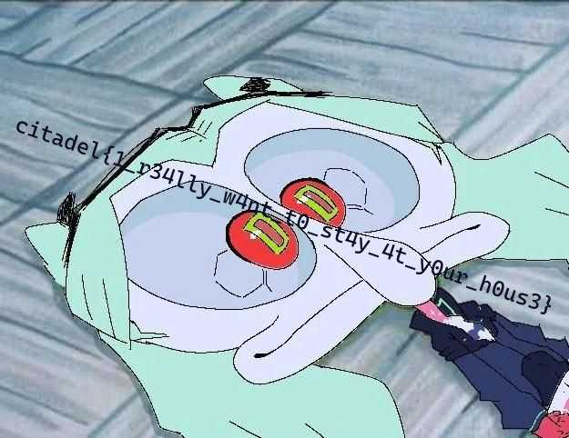

# Echoes and pings 

# Sol : 
we are given a pcap and we can see some image being sent over and some msgs in transit. we can carve the  jpg file which  was sent in over the ICMP protocol


```
chunks = []
for p in pkts:
    if p.haslayer(ICMP) and p.haslayer(Raw):
        chunks.append((getattr(p[ICMP], "seq", 0), p[Raw].load))

chunks.sort(key=lambda x: x[0])

with open("flag.jpg", "wb") as f:
    f.write(b"".join(c for _, c in chunks))
```

# Flag : 