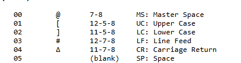

# Solution

learn abt the encoding on : https://www.fourmilab.ch/documents/univac/fieldata.html

wrote the solve script got partial flag followed the Upper case and lower case switches and deleted those parts to get the flag.

`PS C:\Citadel_CTF_Writeups> python c:\Citadel_CTF_Writeups\FIELD_DATA\decode_transmission.py
Decoded message:
[R3B3LL10N${]BU1[LT:0N]H0[P3`
this half flag now we can use : 

to fix the upper and lower

manually fixing the rest : 

# Flag : citadel{r3b3ll10n$&BU1lt:0nH0p3}
