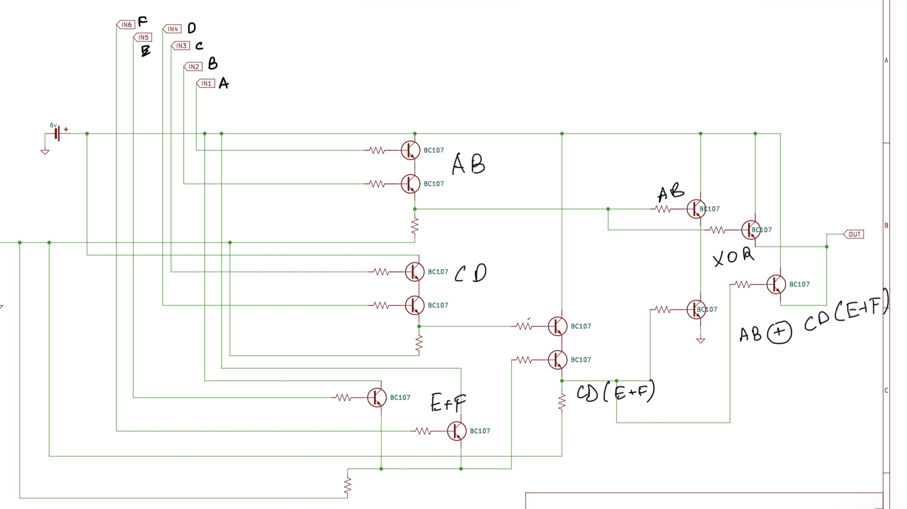

# Gates Of Mayhem

300

Something shifts in the circuitry - slow and deliberate. Your badge brightens to its rim, and the corridor seems to lean toward this door. This is the last lock of this run: clear it, and the climb turns toward its final stretch. Beyond, the steps grow fewer and steeper, the keys heavier, the returns richer. The Citadel isn’t only blocking you; it’s deciding whether to trust you with what comes next.

The guardian of this floor steps forward, a being of twisting wires and glowing circuits, its eyes blinking like LEDs. In its hands is a small hardware lock, a tangle of transistors and logic gates standing between you and the next floor. You must examine the circuit and determine its output. Only by solving it will the path ahead open and allow you to continue your ascent.

We're given a schematic of a few electronic components, and an input CSV.

I look at the model of the transistors given to us, and it's a BC107, an NPN BJT transistor.

## Solution

I immediately try to remake the circuit on [Falstadt](https://tinyurl.com/2347zr8k), But I quickly realise that we don't have the resistance values of the resistors, nor do we have the thresholds for the binary inputs. Finally, We can't import CSVs in falstadt, and I was not going to do 256 inputs for 6 input lines.

I then think of a way to simplify the boolean logic instead of drawing it bruteforcing it. I google on ways to simplify transistor circuits, and find some resources.

The Base of the transistor acts as the boolean input, and the emitter the output.

If the emitter of one feeds into the collector of the other, they're in series. Otherwise, it's parallel.

However, I was stumped by the rightmost system, Which seemed to follow neither logic and gave me a malformed flag. Doing a bit more research, I came to find that it was actually an XOR gate.

Here is how I evaluated them: 

The final simplified equation was:

**AB^(CD(E+F))**

Now, we can make a simple python script to read the inputs from the CSV and parse the flag into ASCII, which gives us the flag.