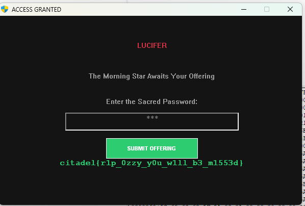
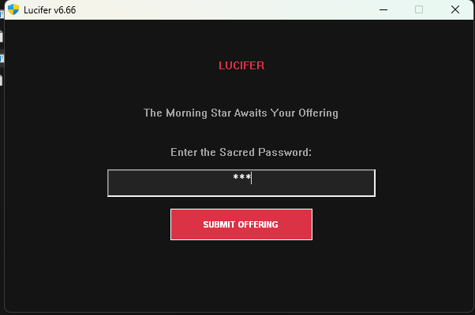

# Mr. Crowley CTF Challenge Solution

### Flag : 

## Challenge Overview
This was a Windows binary reverse engineering challenge where we needed to bypass a password check to reveal the flag.



## Analysis

### reading decompliedExe.c
The decompiled C code revealed:
- A GUI application with a password input field
- A hash-based password verification at line 1588: `if ( v17 == 0xCCD9050F7D99747BuLL )`
- If the password check passes, it sets `byte_140030030 = 1` (line 1725)
- When this flag is set, text containing "citadel{" is displayed in green (line 1789)
- The flag data is encrypted and stored at addresses:
  - xmmword_140023000 = 0x908C06116F5B59FE2E480A9A9823DE4BLL
  - xmmword_140023010 = 0x79E5B68EE7E06C822E3183BD29CE3225LL
  - dword_140023020 = -115693458


###  Finding the fix
Using hexdump,
```
Offset: 0x1428-0x142e
Bytes: 48 39 c2 0f 84 2e 01 00 00
Assembly: 
  cmp rdx, rax          ; Compare computed hash with expected hash
  je  0x155c            ; Jump if Equal to success path
```

### 4. The Patch
The password verification logic was:
- Compute hash of input password
- If hash == 0xCCD9050F7D99747B, grant access
- Otherwise, deny access

To bypass this, I inverted the jump condition:
- Changed `JE` (0F 84) to `JNE` (0F 85)
- This means: Jump to success if hash does NOT equal the target
- Now ANY wrong password (or empty input) grants access!

**Patch applied:**
- Offset: 0x142b
- Original byte: 0x84 (JE - Jump if Equal)
- Patched byte: 0x85 (JNE - Jump if Not Equal)

### 5. Result
After patching:
- Run the patched executable (lucifer_patched.exe)
- Enter any incorrect password (or nothing)
- The password check "fails" but due to the inverted logic, it succeeds
- The flag is decrypted and displayed in the window
- Text containing "citadel{" appears in green color


## The Solution
The flag was revealed when the patched binary ran with an incorrect password, as the inverted logic now grants access when the password check fails rather than succeeds.

