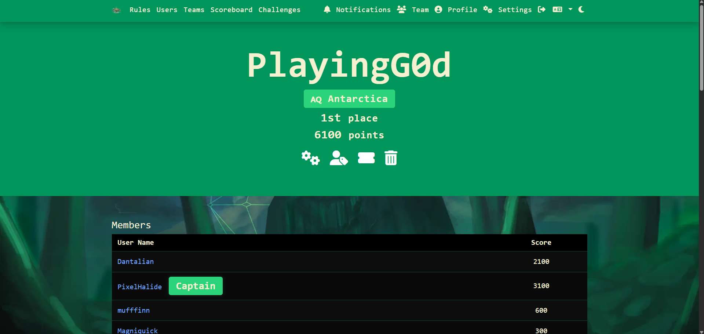
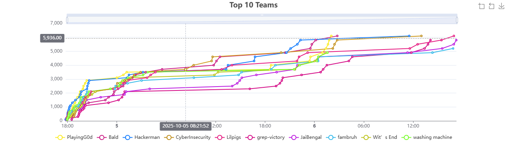
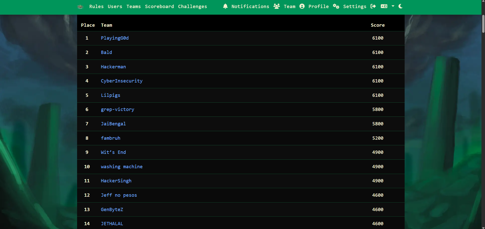

# CITADEL CTF writeups

# Difficulty : Easy

# Team : PlayingG0d

# UserName : Dantalian 

We placed `1st` since it was a beginner ctf and i have decent ctf experience.

My favourite chall was : cake matrix one since it actually took some effort to solve.

BJT switch one also gets a HM

rest was EHH

guessy geoguessr OSINT (im bad at it)